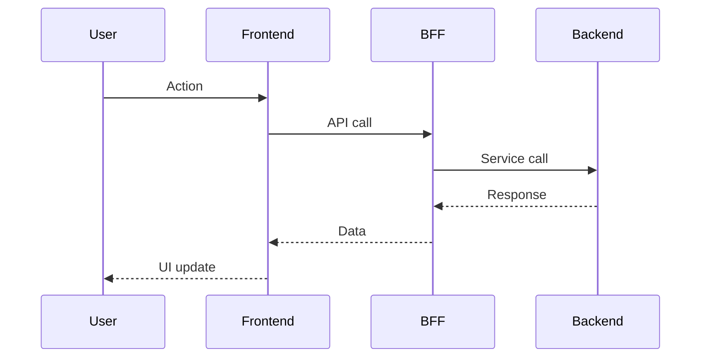
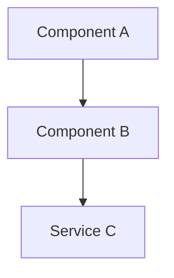

# RFC: [Short RFC description]

> Move this document to Lending Engineering → MGR Pinjam → RFC folder before publishing

| Field | Value |
|-------|-------|
| **Authors** | @dev |
| **Reviewers** | Monetisation Devs, Acq Devs, CX Devs |
| **Approvers** | Leads |
| **RFC** | RFC Jira Link |
| **Pod** | |
| **Stream** | |
| **Status** | DRAFT |
| **Impact** | LOW / MEDIUM / HIGH |
| **Outcome** | |
| **Created Date** | |
| **Closing Date** | |

---

## 📖 Glossary

| Term | Definition |
|------|-----------|
| | |

---

## 📌 Background

<!-- Why does this RFC exist? What is the current state? What are the pain points? Reference the PRD. -->

---

## 🖋️ Requirements

<!-- Technical requirements mapped from PRD. List as numbered items. Always tag each item [BE][service-name] or [FE][service-name]. -->

### Functional Requirements

1. 

### Non-Functional Requirements

1. 

---

## 🚫 Out of scope

<!-- What this RFC does NOT cover. Be explicit. -->

- 

---

## 💡 Solution

### Approach #1 (Preferred)

<!-- The recommended approach. Explain why this is preferred. -->

#### Overview (Optional)

<!-- High-level summary of the approach. -->

#### Sequence Diagram

<!-- Mandatory for almost every solution — shows the actual request/response flow across actors. Use mermaid. Example: -->

#### Block Diagram (Optional)

<!-- Use mermaid diagram, only if component/service relationships need a separate static view. Example: -->

#### Database Modelling (Optional)

<!-- Table schemas, new columns, migrations. -->

### Approach #2

<!-- Alternative approach. Explain trade-offs vs Approach #1. -->

---

## 📋 User Stories

### Story 1:

<!-- User story: As a [role], I want [feature] so that [benefit]. Include Edge Cases if relevant. -->

#### Task 1.1: [BE][service-name] [Task title]

<!-- Specific, actionable, estimable task. Include affected files/components. -->

<!-- Acceptance Criteria: observable outcomes that verify this task is done — put first, before contract/schema detail. -->
- [ ] AC1: 

<!-- API Contract (if applicable): Path / Http Method / Request Headers / Request Body / Response / Response Sample -->

<!-- DB Changes (if applicable): schema/migration changes -->

#### Task 1.2: [FE][service-name] [Task title]

<!--
FE tasks: use the fe-build task checklist format instead of prose "files impacted" tables.
Acceptance Criteria first, then one checklist line per artifact:
  - [ ] <action> <thing> <name> context: <optional>
  action = create | modify | remove
  thing  = css-tokens | l1-service | l2-hook | core-component | feature-component | translation | test-file
  name   = PascalCase svc/comp; camelCase hook; skip for css-tokens/translation
  Order: css-tokens → l1-service → l2-hook → core-component → feature-component → translation → test-file
  Every create/modify pairs a test-file task (Vitest for L0, Cypress for components/feature layer).
-->
- [ ] AC1: 
- [ ] create l1-service <Name> context: 
- [ ] create l2-hook <name> context: 
- [ ] create feature-component <Name> context: 
- [ ] create test-file <Name> context: 

### Story 2:

---

## 🗓️ Timeline

<!-- Key dates/phases. -->

---

## 🚀 Rollout Plan (Optional)

<!-- Feature flags, phased rollout strategy, rollback plan. -->

---

## 🤝 Decision

<!-- Final decision reached, and by whom. Leave empty in draft. -->

---

## ❓ Open questions?

<!-- Unresolved items that need discussion during RFC review. -->

- 

---

## 🔗 References

<!-- Related docs, prior RFCs, external links. -->

- 

---

## 🪑 RFC review meeting notes

<!-- Filled during review meeting. Leave empty in draft. -->

---

## 📎 Follow-up

<!-- Items deferred to after this RFC's scope, tracked separately. -->

- 

---

## 🗄️ Appendix

<!-- Supplementary detail. AI can ignore this section unless referenced elsewhere. -->
