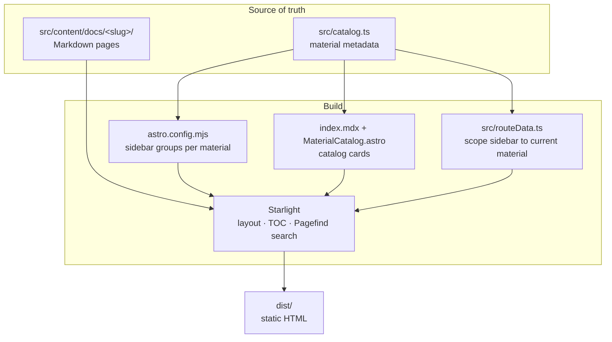
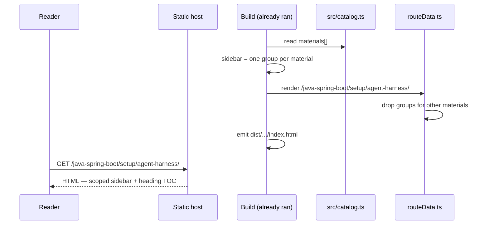

# RFC: LevelUp — learning guide platform, initial release

| Field | Value |
|-------|-------|
| **Authors** | @surdarmaputra |
| **Reviewers** | — |
| **Approvers** | @surdarmaputra |
| **RFC** | `docs/rfcs/0001-levelup-learning-guide-platform.md` |
| **Status** | DRAFT |
| **Impact** | MEDIUM |
| **Outcome** | |
| **Created Date** | 2026-08-20 |
| **Closing Date** | |

---

## 📖 Glossary

| Term | Definition |
|------|-----------|
| **Material** | One complete learning guide. Owns a directory, a URL subtree, a sidebar, and one catalog card. `java-spring-boot` is the first. |
| **Section** | A group of pages inside a material, one per sidebar group — `setup`, `roadmap`, `reference`. |
| **Catalog** | The landing page listing every material, and the module (`src/catalog.ts`) that data comes from. |
| **Base path** | The subdirectory a static site is served from. `/levelup/` on GitHub Pages, `/` on a VPS. |
| **Starlight** | Astro's docs theme. Supplies the sidebar, right-hand table of contents, search, dark mode, and mobile layout. |
| **Scoped sidebar** | A sidebar showing only the current material's tree, not every material on the site. |

---

## 📌 Background

The first learning material — a 26-step Spring Boot roadmap built around an event ticketing
marketplace — exists as eleven Markdown files plus an `AGENTS.md` template. They render fine on
GitHub, but as a reading experience they have real gaps:

- No table of contents inside a page. The roadmap sections run 150–350 lines with five or six
  steps each; there is no way to jump to step 11.
- No search. The rubrics file is a 349-line lookup table meant to be jumped into by ID.
- No navigation between files. Reading order lives in a `README` tree diagram.
- No home for the second material. Everything sits in one flat `docs/` folder named for one topic.

The files were already written with a static site in mind: YAML frontmatter with `title`,
`description`, and `sidebar.order`; one `##` per step; no `<h1>` in the body. The work is to
build the site around them without editing the prose.

The second material is the real design constraint. A structure that publishes one guide well and
needs restructuring for the next one has failed.

---

## 🖋️ Requirements

### Functional Requirements

1. `[SITE]` A landing page listing every learning material as a card: title, description, level,
   size, tags, status, and a link into the material.
2. `[SITE]` Each material is served under its own path prefix, `/<slug>/`.
3. `[SITE]` Every content page renders with a left sidebar for navigation and a right-hand table
   of contents built from its `##` headings — the standard Starlight layout.
4. `[SITE]` The left sidebar on a material page shows **only** that material, so it reads as that
   material's table of contents rather than a site index.
5. `[CONTENT]` The eleven source files keep their prose unchanged. Only frontmatter, file
   location, and link targets change.
6. `[CONTENT]` Each material owns one directory, with one subdirectory per sidebar section.
7. `[SITE]` Full-text search across all materials, built at build time, no external service.
8. `[BUILD]` The site builds to static files and is deployable to GitHub Pages and to a VPS from
   the same source, with no code change between the two.
9. `[CI]` Push to `main` builds and publishes to GitHub Pages automatically.
10. `[HARNESS]` The repo carries an agent harness: `AGENTS.md`, project skills, and a single
    verify command an agent can run unsupervised.

### Non-Functional Requirements

1. `[BUILD]` Adding a material means creating a content directory and one entry in a metadata
   module. No changes to the site config, the sidebar, or the landing page.
2. `[BUILD]` A broken internal link fails the build. Relative links across a restructured tree
   are easy to get wrong by one `../`, and the failure is invisible until a reader hits it.
3. `[SITE]` No client-side framework and no runtime. Static HTML, CSS, and Starlight's own
   scripts only.
4. `[SITE]` Dark mode, mobile layout, and keyboard-accessible navigation come from the theme
   rather than custom code.
5. `[HARNESS]` Vendored skills stay as close to their upstream source as possible, so they can
   be updated with the upstream installer instead of merged by hand. Where a local patch is
   unavoidable, it is recorded and a check fails the build if it silently reverts.

---

## 🚫 Out of scope

- **Authoring UI or CMS.** Content is Markdown in git.
- **Versioning of materials.** A material has one current version. If v2 of a roadmap ever needs
  to coexist with v1, that is a separate RFC.
- **Internationalisation.** Starlight supports it; nothing here needs it yet, and turning it on
  changes every URL.
- **Comments, ratings, accounts, progress tracking.** All of these need a backend. The site stays
  static.
- **Analytics.** Deferred deliberately — it is a privacy and CSP decision, not a build decision.
- **Editing the learning content.** Fixing links and frontmatter is in scope. Rewriting prose is not.
- **A custom domain.** GitHub Pages default URL for now; the base-path handling makes the switch a
  one-line change later.

---

## 💡 Solution

### Approach #1 (Preferred) — Catalog-driven materials with scoped sidebars

One Astro + Starlight site. Each material is a directory under `src/content/docs/`, and a
single metadata module describes them all. The sidebar config and the landing page are both
derived from that module, so a material is registered once.

#### Overview

Three pieces do the work:

**`src/catalog.ts`** — the metadata for every material: slug, title, description, level, size,
tags, status, the page its card links to, and its section list. It is the only place a material
is declared.

**`astro.config.mjs`** — imports the catalog and builds one top-level sidebar group per material,
with one autogenerated subgroup per section. Autogeneration means page order inside a section
comes from each page's `sidebar.order` frontmatter, so adding a page needs no config edit.

**`src/routeData.ts`** — a Starlight route middleware that drops the sidebar groups belonging to
other materials before the page renders. Without it, every material's tree would appear on every
page. With it, the sidebar is scoped to the material being read, which is requirement 4.

#### Block Diagram



#### Request Flow



#### Content structure

The eleven source files move from a flat `docs/` folder into the material's own tree. Prose is
untouched; frontmatter already carried `title`, `description`, and `sidebar.order`.

| Source file | Destination | Served at |
|---|---|---|
| `01-getting-started.md` | `java-spring-boot/getting-started.md` | `/java-spring-boot/getting-started/` |
| `01-agent-harness.md` | `java-spring-boot/setup/agent-harness.md` | `/java-spring-boot/setup/agent-harness/` |
| `02-reviewer-setup.md` | `java-spring-boot/setup/reviewer-setup.md` | `/java-spring-boot/setup/reviewer-setup/` |
| `00-overview.md` | `java-spring-boot/roadmap/overview.md` | `/java-spring-boot/roadmap/overview/` |
| `01-foundations.md` | `java-spring-boot/roadmap/foundations.md` | `/java-spring-boot/roadmap/foundations/` |
| `02-domain-depth.md` | `java-spring-boot/roadmap/domain-depth.md` | `/java-spring-boot/roadmap/domain-depth/` |
| `03-integration.md` | `java-spring-boot/roadmap/integration.md` | `/java-spring-boot/roadmap/integration/` |
| `04-fullstack.md` | `java-spring-boot/roadmap/fullstack.md` | `/java-spring-boot/roadmap/fullstack/` |
| `05-advanced.md` | `java-spring-boot/roadmap/advanced.md` | `/java-spring-boot/roadmap/advanced/` |
| `01-rubrics.md` | `java-spring-boot/reference/rubrics.md` | `/java-spring-boot/reference/rubrics/` |
| `02-omissions.md` | `java-spring-boot/reference/omissions.md` | `/java-spring-boot/reference/omissions/` |
| `AGENTS.md` (template) | `java-spring-boot/reference/agents-template.md` | `/java-spring-boot/reference/agents-template/` |

Two new pages: `java-spring-boot/index.md`, a material overview with link tables, and
`index.mdx`, the site landing page.

The `AGENTS.md` template becomes a content page rather than staying a repo-root file. In the
source it was linked as `https://github.com/YOUR-REPO/blob/main/AGENTS.md` — a placeholder that
would have shipped broken. As a page it is readable in place, and the repo root is free for this
project's own harness file.

#### Base path handling

The site must serve from `/levelup/` on GitHub Pages and `/` on a VPS. Astro's `base` prepends
the prefix to links it generates, but **not** to links inside Markdown — those pass through
untouched. An absolute `/java-spring-boot/setup/` in a Markdown file therefore works on exactly
one of the two targets.

Decision: **every internal Markdown link is relative**, and `SITE_URL` / `BASE_PATH` are
environment variables read by `astro.config.mjs`, defaulting to the GitHub Pages values.

Relative links have their own failure mode. Pages build to directories with a trailing slash, so
the last URL segment is a directory: a page at `<slug>/setup/foo.md` is served at
`/<slug>/setup/foo/`, and reaching a sibling section takes `../../`, not `../`. Getting that
wrong produces a link that resolves to nothing and fails silently — which is exactly what
happened while moving these files, in three separate places.

So `scripts/check-links.mjs` resolves every internal `<a href>` in `dist/` against the real
output files and fails on two conditions: a link that resolves to no page, and an absolute link
missing the base path. It runs inside `npm run verify`, in the pre-push hook, and in CI.

#### Why Starlight's defaults are left alone

Requirement 3 — sidebar plus per-page table of contents — is Starlight's default layout. Search
(Pagefind), dark mode, mobile navigation, and previous/next pagination are also defaults. The
custom code is three small files: the catalog module, the route middleware, and one card-grid
component. `src/styles/custom.css` holds three rules. Everything else is theme behaviour, which
is the point of picking a docs framework.

### Approach #2 — Flat docs tree with one global sidebar

Keep the eleven files near their current flat layout under `src/content/docs/`, write the sidebar
by hand in `astro.config.mjs`, and hand-write the landing page cards in `index.mdx`.

| Dimension | Approach #1 | Approach #2 |
|---|---|---|
| Work for release 1 | Higher — catalog module, route middleware, card component | Lower — config and one page |
| Adding material #2 | Content directory + one catalog entry | Edit config, edit landing page, restructure directories |
| Sidebar with 3+ materials | Scoped to the current material | Every material's tree on every page, or hand-maintained groups |
| Risk of drift | Sidebar and landing page read the same source | Two hand-maintained lists that will disagree |
| Custom code | ~120 lines across 3 files | ~40 lines, growing linearly with materials |

Rejected because the cost lands on exactly the operation this project exists to repeat. Approach
#2 is cheaper once and more expensive every time after, and its failure mode — a landing page
listing a material the sidebar doesn't, or the reverse — is the kind that ships unnoticed.

A third option, one Starlight site per material with a static index page in front, was dismissed
earlier: it splits search, duplicates config and CI per material, and gives each material a
slightly different theme within a year.

---

## 📋 User Stories

### Story 1: A reader finds and reads a learning material

*As an engineer landing on the site, I see what is available, pick one, and can navigate it
without going back to the home page.*

**Edge cases:** a material listed but not yet written (`status: 'planned'` — dimmed card, no
link, absent from the sidebar); a reader arriving from search deep inside a material (sidebar
shows their position in that material's tree).

#### Task 1.1: `[SITE]` Scaffold the Astro + Starlight project

- [x] AC1: `npm run dev` serves the site locally; `npm run build` writes static HTML to `dist/`.
- [x] AC2: `astro check` reports zero errors on a clean tree.
- [x] AC3: `mdx()` is registered **after** `starlight()` — the reverse order fails the build,
      because Expressive Code must wrap MDX code blocks.

Files: `package.json`, `astro.config.mjs`, `tsconfig.json`, `src/content.config.ts`.

#### Task 1.2: `[CONTENT]` Restructure the source content into a material directory

- [x] AC1: All eleven source files live under `src/content/docs/java-spring-boot/`, split into
      `setup/`, `roadmap/`, and `reference/`, with prose unchanged.
- [x] AC2: `sidebar.order` in each file is correct relative to its own directory.
- [x] AC3: The `AGENTS.md` template renders as `reference/agents-template.md`, with its `<h1>`
      stripped and frontmatter added.
- [x] AC4: No link anywhere still points at a `/0N-*/` path or at `YOUR-REPO`.

#### Task 1.3: `[SITE]` Build the catalog module and landing page

- [x] AC1: `src/catalog.ts` exports a typed `materials` array; every field the card and sidebar
      need comes from it.
- [x] AC2: `/` renders one card per material with title, description, level, size, tags, and
      status, and links to the material's entry page.
- [x] AC3: Card links carry the configured base path.
- [x] AC4: A `planned` material renders dimmed and unlinked.

Files: `src/catalog.ts`, `src/components/MaterialCatalog.astro`, `src/content/docs/index.mdx`.

#### Task 1.4: `[SITE]` Generate and scope the sidebar

- [x] AC1: The sidebar has one group per published material, each with one subgroup per section,
      autogenerated from the section's directory.
- [x] AC2: On a material page, other materials' groups are absent.
- [x] AC3: The right-hand table of contents lists the page's `##` headings.
- [x] AC4: Previous/next pagination follows sidebar order.

Files: `astro.config.mjs`, `src/routeData.ts`.

#### Task 1.5: `[SITE]` Material overview page, 404, and theme

- [x] AC1: `/java-spring-boot/` renders an overview with link tables into every section.
- [x] AC2: A missing URL renders a styled 404 whose links are built from
      `import.meta.env.BASE_URL`, so they work under both base paths.
- [x] AC3: Theme overrides are confined to `src/styles/custom.css`.

### Story 2: The site deploys to two different hosts from one source

*As the maintainer, I publish to GitHub Pages today and move to a VPS later without editing
anything but two environment variables.*

#### Task 2.1: `[BUILD]` Make the base path configurable and enforce link correctness

- [x] AC1: `SITE_URL` and `BASE_PATH` are read in `astro.config.mjs`, defaulting to the GitHub
      Pages values.
- [x] AC2: `BASE_PATH=/ npm run build` produces a site whose links all resolve at the root.
- [x] AC3: `scripts/check-links.mjs` fails on an unresolvable internal link and on an absolute
      link missing the base path, and reports the page, the raw link, and what it resolved to.
- [x] AC4: `npm run verify` runs check → build → link check and is non-zero if any step fails.

#### Task 2.2: `[CI]` Publish on push to `main`

- [x] AC1: `.github/workflows/deploy.yml` builds and deploys to GitHub Pages on push to `main`,
      deriving `SITE_URL` and `BASE_PATH` from the repository so a rename needs no edit.
- [x] AC2: The workflow runs the link check against the built output before publishing.
- [x] AC3: `.github/workflows/ci.yml` runs `verify` on pull requests.
- [x] AC4: The README documents the VPS path — build with `BASE_PATH=/`, rsync `dist/`.

### Story 3: An agent can work on this repo without guessing

*As a contributor working with a coding agent, the agent knows the conventions, has the skills
it needs, and can verify its own work in one command.*

#### Task 3.1: `[HARNESS]` Author the harness files

- [x] AC1: `AGENTS.md` states the stack, layout, the verify loop, and the non-negotiable
      conventions — relative links, catalog as single source of truth, static output only.
- [x] AC2: `CLAUDE.md` is a symlink to `AGENTS.md`, so every tool reads one file.
- [x] AC3: `.claude/settings.json` runs `scripts/bootstrap.sh` on session start and pre-approves
      the read-only and verify commands.
- [x] AC4: `scripts/bootstrap.sh` is idempotent: installs dependencies and the Lefthook pre-push
      hook, and is safe to re-run.

#### Task 3.2: `[HARNESS]` Install skills

- [x] AC1: Five skills vendored from `surdarmaputra/agent-skills` at commit `2b3eaea`:
      `code-review-enhanced`, `conventional-commit`, `grill-me`, `prd-to-rfc`,
      `skill-creator-compact`. Four are byte-identical to upstream.
- [x] AC2: `prd-to-rfc` is patched to remove the organisation it was written in — a "move this
      to the Lending Engineering folder" instruction, that org's team names pre-filled as
      reviewers, a Jira reference, a "cash-loans" description, and its Lark hostname in the URL
      examples. Left in place, every one of them would have been copied into the first RFC
      generated from the template.
- [x] AC3: `.claude/skills/README.md` records the provenance, the upstream update command, and
      the patch as a table of what was removed and what replaced it.
- [x] AC4: `scripts/verify-project.sh` greps every tracked file for those terms and fails the
      build if they reappear, so an `--update` that reverts the patch cannot land unnoticed.
- [x] AC5: Two project-local skills: `add-material` (scaffold a material end to end) and
      `verify-site` (run the loop, read its failures).

#### Task 3.3: `[HARNESS]` Write this RFC

- [x] AC1: Records the structure decision, the base-path decision, and the rejected alternative,
      following the `prd-to-rfc` template.

---

## 🗓️ Timeline

Single release, no external dependency. Milestone 1 (Stories 1–3) is the initial bootstrap and
is complete. Milestone 2 is whatever the second material demands.

---

## 🚀 Rollout Plan

No feature flags — a static site has one state. Rollout is: enable GitHub Pages with
**Settings → Pages → Source → GitHub Actions**, then push to `main`.

Rollback is `git revert` plus a push; the workflow republishes the previous build. Deploys are
whole-site and atomic, so there is no partial state to recover from.

---

## 🤝 Decision

<!-- Filled after review. -->

---

## ❓ Open questions?

1. **Custom domain.** Staying on `surdarmaputra.github.io/levelup/` keeps `BASE_PATH` non-empty
   and every relative-link rule load-bearing. A custom domain at `/` would remove a whole class
   of bug. Worth doing before material #2, or after?
2. **Where does the second material come from?** The structure is designed for N materials but
   validated against one. The first addition is the real test of the "content directory plus one
   catalog entry" claim.
3. **`status: 'draft'`.** The catalog supports it and nothing uses it. Should a partially written
   material be publicly visible with a badge, or stay unlisted until complete?
4. **The `prd-to-rfc` patch.** It lives here as a local diff, guarded by a grep. Cleaner to
   land it upstream in `surdarmaputra/agent-skills` — the org-specific lines are wrong for
   every consumer, not just this repo — and then delete both the patch and the guard. Worth
   opening that PR?
5. **Repo-root `AGENTS.md` vs the published template.** This repo's harness file and the
   TicketFlow template a reader copies are two different documents with the same name. The
   template is a content page now, which resolves it — but a contributor may still open the wrong
   one. Rename the published page?
6. **Analytics.** Deferred. If it is ever added, the choice needs to survive a static host with
   no server-side logging and a strict CSP.

---

## 🔗 References

- [Starlight documentation](https://starlight.astro.build/id/getting-started/)
- [Starlight route middleware](https://starlight.astro.build/guides/route-data/) — the mechanism behind the scoped sidebar
- [Astro `base` configuration](https://docs.astro.build/en/reference/configuration-reference/#base)
- [`surdarmaputra/agent-skills`](https://github.com/surdarmaputra/agent-skills) — source of the vendored skills
- [`AGENTS.md`](../../AGENTS.md) — the conventions this RFC's decisions became

---

## 🪑 RFC review meeting notes

<!-- Filled during review. -->

---

## 📎 Follow-up

- Add material #2 and confirm the two-step add really is two steps.
- Decide the custom-domain question, then drop `BASE_PATH` to `/` if it is taken.
- Consider a `LinkCard`-based "next step" footer on each roadmap section, once there is data on
  where readers stop.
- Revisit `src/styles/custom.css` if content pages start needing components beyond tables and
  code blocks.
- Send the `prd-to-rfc` de-org patch upstream, then drop the local patch and its grep guard.

---

## 🗄️ Appendix

### Commands

```bash
npm run dev        # local dev server
npm run verify     # astro check → build → internal link check
npm run build      # production build, GitHub Pages base path

# VPS build
SITE_URL=https://learn.example.com BASE_PATH=/ npm run build
```

### Adding a material

```ts
// src/catalog.ts
{
  slug: 'go-distributed-systems',
  title: 'Distributed Systems in Go',
  description: '…',
  tagline: '…',
  level: 'Advanced',
  size: '18 chapters',
  tags: ['Go', 'Raft', 'gRPC'],
  status: 'planned',
  entry: 'go-distributed-systems/getting-started',
  links: [{ label: 'Overview', slug: 'go-distributed-systems' }],
  sections: [{ label: 'Chapters', directory: 'chapters' }],
}
```

Then create `src/content/docs/go-distributed-systems/` with an `index.md` and a `chapters/`
directory, and run `npm run verify`.
